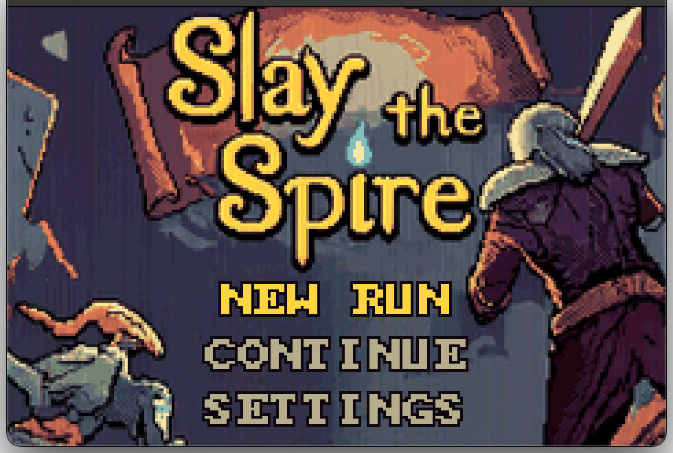
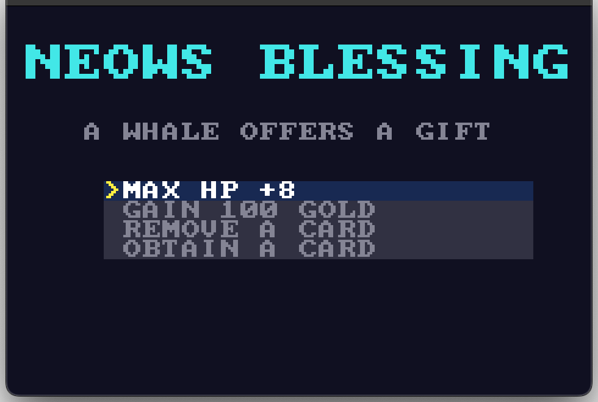
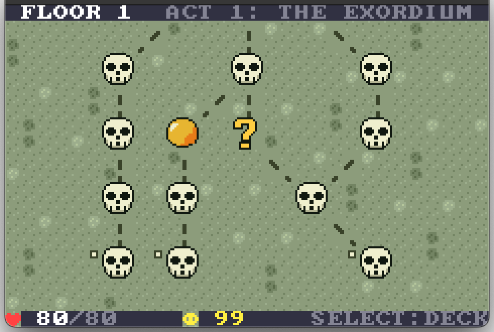
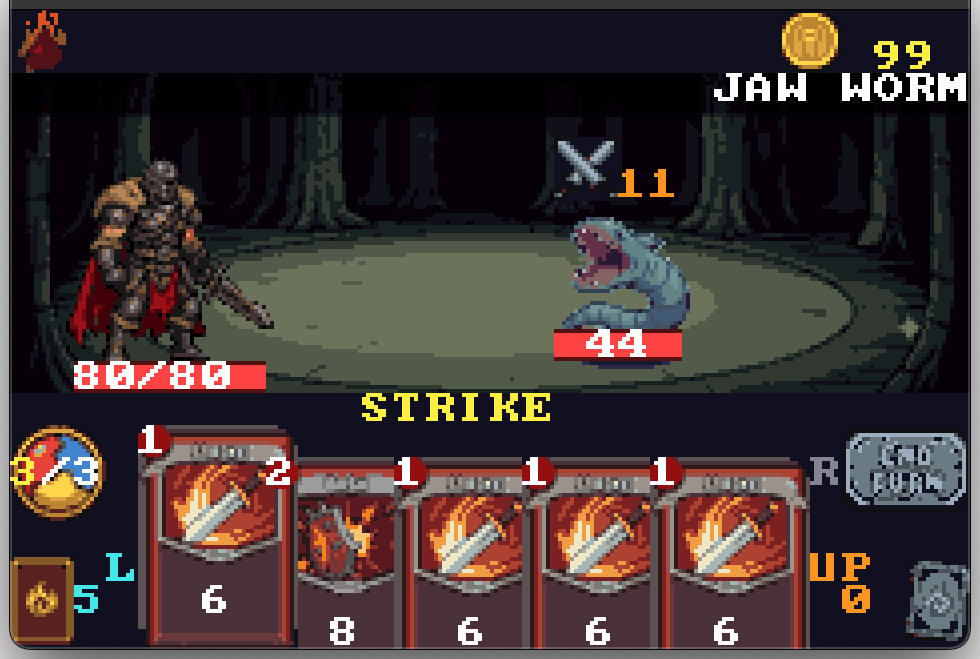
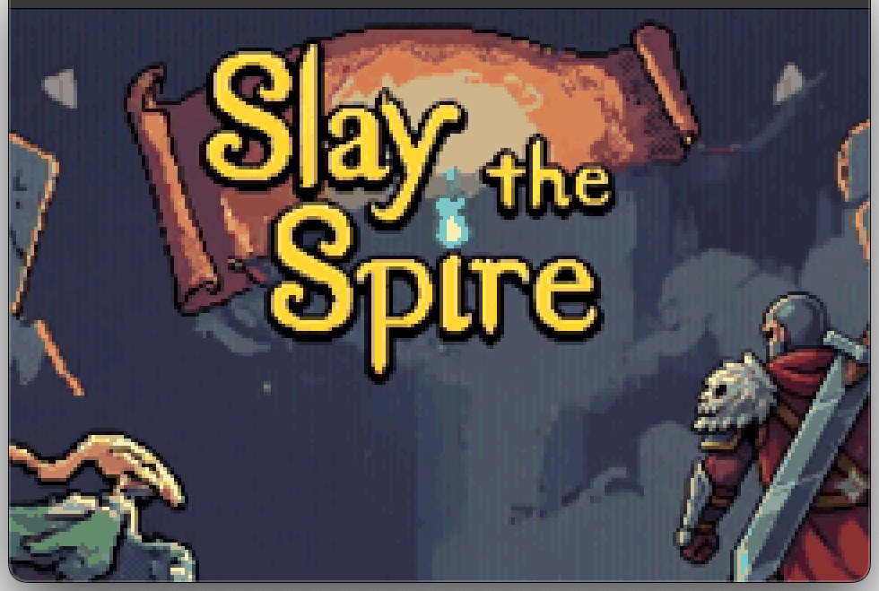
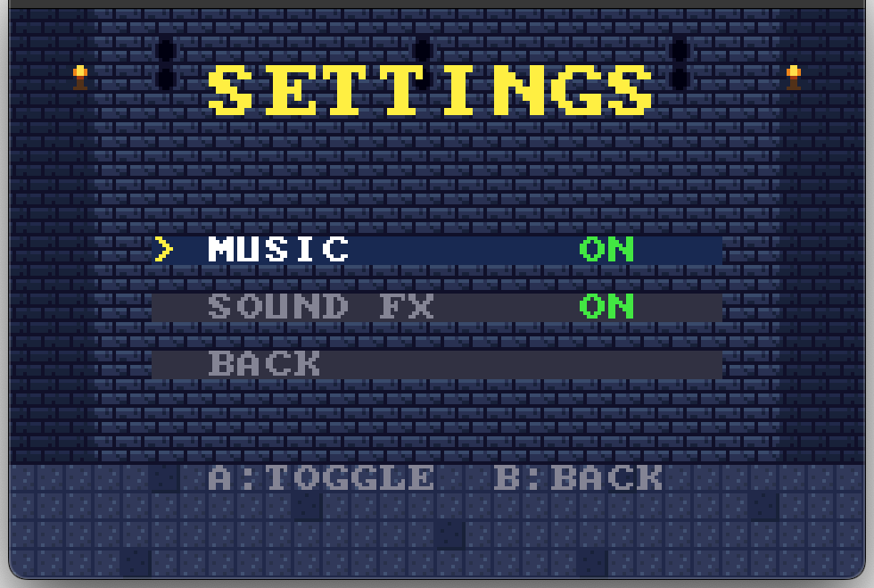

# spire-gba

A from-scratch **Game Boy Advance** demake of *Slay the Spire* — Act 1, Ironclad.
Single-player, single-character, single-act. Built as a learning project; the entire engine
(graphics, audio, input, save, RNG, scene state machine) is hand-written C/ARM Thumb assembly,
no SDK, no libc, no external assets at runtime.

Runs on real hardware or an emulator (tested on mGBA). **60 fps**, ~9.6 MB ROM, ~32 KB SRAM save.

## What's in it

| | |
|---|---|
| **Game** | Full Act 1: 15-floor procedural map, 7 monster types, 3 elites, 3 bosses (Slime Boss, Guardian, Hexaghost), 4 events, shop, rest site, treasure room, Neow's Blessing opener, victory + game-over |
| **Cards** | 32 Ironclad cards + 4 statuses; upgrade paths; power / attack / skill / status split; combat pile (draw / hand / discard / exhaust) with full inspect + zoom; per-card art + per-card computed effect text |
| **Relics** | 8 relics with combat hooks (Burning Blood, Vajra, Bronze Scales, Anchor, Lantern, Strawberry, Bag of Preparation, Blood Vial) + in-pause relic viewer with effect descriptions |
| **Potions** | 3-slot belt (HP / Strength / Block / Energy) — drops, shop, combat pick & drink |
| **Map** | 4-random-walk generator with post-pass StS-style balance rules (no back-to-back shops, no early elites, no 3× room type runs, ≤2 elites / ≤3 shops per act, floor 14 = rest, floor 0/1 = monster) |
| **Save** | 32 KB SRAM with header+checksum, settings + run+map+rng snapshot, autoload on Continue |
| **Audio** | PCM music streaming on FIFO A (timer0 / DMA1, s8 @ 13379 Hz), sampled one-shot SFX on FIFO B, PSG sfx layer over the stream in hardware. Three tracks: intro, title, run. |

## Screenshots

| | |
|---|---|
|  |  |
| **Title** — `NEW RUN` / `CONTINUE` / `SETTINGS` over the key art | **Neow's Blessing** — first screen of every run |
|  |  |
| **Map** — 7×15 procedural floors, icon nodes + dashed path, reachable dots | **Battle** — new 64×64 hero, 5-card hand, orb/draw/end-turn HUD, live intent + damage |
|  |  |
| **Intro** — cold-boot cinematic (splash slides → video → fade-up into title) | **Settings** — music + SFX toggles, persists to SRAM |

## Build

```
make           # → build/spire.gba  (ship build, 9600 KB)
make run       # build + open in mGBA
```

Toolchain: `arm-none-eabi-gcc` (Homebrew), Python 3 + Pillow + NumPy + ffmpeg for asset
generation. Tool versions verified in [`PROGRESS.md`](PROGRESS.md).

Test build entry points (boot straight into a specific screen, used for screenshot/soak):

| Flag | Boots into |
|---|---|
| `make EXTRA=-DBATTLETEST` | A jaw worm fight (deterministic) |
| `make EXTRA=-DMAPTEST`    | Pre-walked map |
| `make EXTRA=-DSETTINGSTEST` | Settings menu |
| `make EXTRA=-DTITLETEST`  | Title menu |
| `make EXTRA=-DNEOWTEST`   | Neow's Blessing |
| `make EXTRA=-DAUTOPLAY`   | Self-playing monkey build for soak tests |

## Controls

**Title / menus:** `↑/↓` select, `A` confirm, `B` back/cancel, `START` settings, `L/R` adjust

**Map:** `↑/↓` pan floors, `←/→` move cursor, `A` select, `B` deck, `START` pause

**Battle:**
- `←/→` pick a card from hand
- `A` play (targets nearest live enemy; targeting mode: `A` attack, `B` cancel)
- `B` deck browser
- `SELECT` potion picker
- `L` draw pile, `↑` discard, `↓` exhaust
- `R` end turn, `START` pause

**Card lists (deck / shop / reward / inspect):**
- `↑/↓` navigate
- `A` zoom (big card face + computed effect text) or pick
- `SELECT` info (in shop / reward)
- `B` back

## Project layout

```
src/         # C/ASM source (engine, scenes, combat, screens, cards, audio, save)
tools/       # Python asset pipelines (PNG -> C arrays, mkpcm, mksfx, mksprites, ...)
assets/      # Source PNGs / WAVs the pipelines consume
build/       # Compiled output (untracked, regenerable)
PROGRESS.md  # Day-by-day build log with verification steps
```

## Engine highlights

- **Mode 0**, BG0 text (30×20 grid, 4bpp font), BG1 UI frames + bars, BG2 scenery (32×64 scrolling layer with 6 palette banks), OBJ sprites in 1D layout
- **OBJ VRAM**: 32 KB, 16 banks. 14 banks hold 15 enemy species (32×32) + 16-tile shadow + 2×-scaled big variants. **Bank 14** holds the new 64×64 player hero (512 tiles at OBJ tile base 512)
- **DMA1** streams the looping music track to FIFO A at 224 samples / frame (vblank-locked); **DMA2** does one-shot SFX on FIFO B; PSG sfx layer on top in hardware
- **SRAM** 32 KB, byte-wise access (8-bit bus), 8-cycle waitstate, header+checksum, save snapshot on every room-resolved→map transition
- **BG mosaic + BLDY brightness-down** for the encounter transition (Pokémon-style zoom)
- **Mode 4** double-buffered for the cold-boot intro video
- **Custom linker script** (`src/gba.ld`), `crt0.s` entry, `tools/gbafix.py` for the Nintendo logo + header checksum

## Asset pipeline

All visual / audio assets are generated from source PNGs / audio files in `assets/` by small
Python tools in `tools/`:

| Tool | Reads | Writes |
|---|---|---|
| `mksprites.py` | `tools/art.txt` ASCII | `src/sprites.h` (15 enemy species + shadow) |
| `mkhero.py`    | `updated-protagonist-sprite.png` | `src/heroimg.h` (64×64 hero) |
| `mkbg.py`      | `tools/bgart.txt`              | `src/bgtiles.h` (BG2 scenery + icons) |
| `mkcards.py`   | `assets/cards/*.png`           | `src/cardimg.h` (40×56 per-card art) |
| `mkhud.py`     | `assets/battle-ui/*.png`       | `src/hudimg.h` (HUD + relic icons) |
| `mkbattlebg.py`| `tools/battlebg_src.png`       | `src/battlebg.h` (battle backdrop) |
| `mkimage.py`   | `tools/title_src.png`          | `src/title_img.h` (mode-4 title bitmap) |
| `mkvideo.py`   | source mp4                     | `assets/intro/intro.bin` (cold-boot video) |
| `mkslides.py`  | `assets/pre-intro-images/*.png`| `assets/slides/slides.bin` |
| `mkpcm.py`     | source audio                   | `assets/music/*.pcm` (13379 Hz s8) |
| `mksfx.py`     | synth / source audio           | `assets/sfx/*.pcm` (13379 Hz s8 one-shots) |
| `assets.py`    | `assets/` PNGs                 | splice back into art sources (round-trip) |

Round-trip supported: edit `assets/`, run `python3 tools/assets.py import`, rebuild.

## License & use

Personal-use project, no redistribution. Slay the Spire is © Mega Crit; this is a fan
demake made for fun.
